# 多 Agents 系统「步骤评估与时延归因」执行方案

> 版本：v1.0  ｜  日期：2026-05-25  ｜  状态：草案，待评审

---

## 附录：原型开发与迭代备忘

### 待办事项 (TODO)
- [ ] **恢复演示数据开关**：在原型阶段（`docs/plans/prototype/docs.html`），“演示数据”开关已暂时隐藏（添加了 `hidden` 类）。**待后续系统接入真实的后端诊断数据后**，需要将该开关恢复显示，并完善其一键切换“真实数据/预置 Mock 数据”的全局功能，以便于向新用户展示产品。

## 一、背景

### 1.1 问题现象

用户提交请求后，**体感上系统响应偏慢**。这是一个"多智能体协作"系统——一个请求会经过多个 Agent 分工处理（路由、检索、推理、生成等），但我们目前：

- **不确定"哪里慢"**：是某个 Agent 本身慢？还是 Agent 之间串行等待？还是资源调度排队？
- **不确定"还能不能更快"**：当前的时延是合理的、还是存在优化空间？

### 1.2 三个无法回答的问题

面对一条慢请求，我们无法回答：

1. **时间花在了哪一步？** 是模型本身推理慢？是调用外部工具慢？还是多个 Agent 之间串行等待导致的？
2. **每一步思考是否必要？** Agent 是否在做无用功——反复自我修正、反复重试同一个失败的工具、或者在原地兜圈子？
3. **"慢"是否换来了"准"？** 多花的时间是否真的提升了答案质量，还是仅仅在"白等"？

### 1.3 根本原因

**Agent 内部是一个"语义黑盒"**。我们能看到用户的输入和最终的输出，但中间发生了什么——哪个 Agent 跑了多久、调用了什么工具、重试了多少次、每一步是否有信息增益——这些关键信息要么没有记录，要么记录格式不统一，无法做系统性分析和归因。

简单说：**我们有"结果"，没有"过程"；有"症状"，没有"诊断"。**

## 一·补、术语白话表（先看这个再读后文）

| 术语 | 一句话解释 | 通俗类比 |
|---|---|---|
| **DAG（有向无环图）** | 把 agent 的调用顺序画成箭头图，谁先谁后、谁等谁一目了然 | 工程甘特图 |
| **Kairos ID 传播** | Kairos 论文中的做法：给每条 query 发一个"快递单号"（Message ID + Upstream Name + 时间戳），让所有 agent 处理时都带上，最终自动拼出完整调用图 | 快递追踪号 |
| **OTel（OpenTelemetry）** | 业界通用的分布式追踪标准，定义了 `trace_id`、`span_id`、`duration_ms` 等基础字段，让不同系统的日志格式统一 | 全国统一快递单格式 |
| **MAESTRO** | 专门针对 Agent/LLM 系统的评估标准，定义了 `gen_ai.usage.input_tokens`、`tool_name`、`retry_count` 等 GenAI 特有字段 | 快递单上的"特殊货物标注栏" |
| **eBPF 兜底采集** | Linux 内核技术，不改业务代码就能从内存里抓加密前的数据，用于无法改造的旧系统 | 水管外装透视镜 |
| **Critical Path（关键路径）** | DAG 上最长的那条串行链，决定整体最快多久跑完 | 工程的"卡脖子"工序 |
| **LAMaS** | 一种把 agent 系统建模成 DAG、并算关键路径的方法论 | DAG 分析方法学 |
| **Retry Storm（重试风暴）** | agent 在某一步反复失败重试，把系统拖垮 | 电话占线时疯狂重拨 |
| **Wasted Token（浪费 Token）** | 花在失败重试上、对最终答案没贡献的那部分 token | 打废的草稿纸 |
| **LCS Similarity** | 对比两次执行的步骤序列重合度，衡量系统稳定性 | 两份食谱步骤的重合度 |
| **MAESTRO** | 一套统一遥测接口标准 + 评估方法（LCS 等） | 评估行业的"普通话" |
| **TTFT / TBT** | 首 token 时间 / token 间隔时间，区分是 prompt 太长还是模型本身慢 | 上菜慢 vs 吃得慢 |
| **慢思考 ROI** | Δ准确率 ÷ Δ时延，判断多花的时间是否换来了更好的答案 | 加班产出的性价比 |
| **LLM-as-Judge** | 用一个更强的大模型当评委，给 agent 每一步打分 | 专家旁听陪审 |
| **ARIA** | 让评委按结构化反思问题给 agent 打分的框架 | 陪审员的标准化问卷 |
| **Reflexion** | 一套启发式守卫规则（如 30 步上限、3 次重复判死循环） | 跳表保护 |
| **断路器（Circuit Breaker）** | 设上限（成本/步数），超了就强制停 | 电闸跳闸 |
| **帕累托前沿** | 在「快、准、省」里，那些"再优化任一项就得牺牲另一项"的最优配置集合 | 性价比最高的那批方案 |
| **Pxx（P50/P95/P99）** | 第 xx 百分位的时延，反映多数 / 长尾用户的体验 | 全班成绩的中位 / 倒数 5% |
| **SRTF 调度** | "最短剩余时间优先"，让快完成的任务插队，缩短整体排队 | 超市少件商品快速通道 |
| **显存感知分配** | 提前预估每个任务占多少 GPU 显存，分给最合适的卡，避免 OOM 重跑 | 给大件行李分大车位 |
| **OOM（Out of Memory）** | 显存爆了，任务被踢掉重跑 | 行李塞不下被退回 |
| **MCP（Model Context Protocol）** | 标准化的"工具协议"，让 Agent 能连接外部服务、数据库、文件系统等 | 通用插座，能插各种电器 |
| **Skill（技能包）** | 封装好的"能力包"，可能包含多个工具调用 + 逻辑 + prompt | 工具箱，里面有螺丝刀、扳手、说明书 |

## 二、目标与关键结果（OKR）

**Objective（目标）：**
建立一套行业领先的“可观测、可量化、可自动诊断”的 Agentic RL 评估体系，全面驱动系统性能与智能体思考质量的优化。

**Key Results（关键结果）：**
- **KR1（看得见 - 全面观测）**：实现请求执行过程的完全可观测性，调用图（DAG）还原覆盖率提升至 **≥ 99%**。
- **KR2（算得出 - 多维度度量）**：建成统一的指标看板，**100% 覆盖**时延、关键路径、重试风暴、步骤合理性、慢思考 ROI、成本及基础设施稳定性等 7 大核心维度。
- **KR3（改得动 - 自动化拦截与诊断）**：实现异常模式的 **100% 自动熔断与告警**（死循环连续 3 次自动中断；Retry Rate > 0.3 或 Wasted Token > 5% 自动告警；慢思考 ROI < 0 标记可疑）。
- **KR4（基础设施红线与自愈）**：将 GPU OOM 重跑率控制在 **< 1%**，排队时长占 E2E 比例控制在 **< 30%**，越线即自动触发 SRTF/显存感知等调度优化。
## 三、核心评估维度

| # | 维度 | 关键指标 | 异常阈值 → 动作 |
|---|---|---|---|
| 1 | **时延 Latency** | 端到端 E2E、各 step 时延、TTFT/TBT、关键路径长度 | E2E P95 超 SLA → 告警 |
| 2 | **关键路径 Critical Path** | LAMaS 方法识别 DAG 最长依赖链 | E2E ≈ CP → 串行瓶颈，需优化编排；E2E >> CP → 调度/排队问题 |
| 3 | **重试风暴 Retry Storm** | 工具 Retry Rate、Wasted Token Ratio | Retry Rate > 0.3 或 Wasted Token > 5% → 自动告警 |
| 4 | **步骤合理性 Step Quality** | 信息增益、冗余度、收敛性、LCS 自相似度 | 连续 3 次相同 action+反馈 → 判定死循环，自动中断；LCS 自相似度 > 0.9 → 标记为可疑 |
| 5 | **时长 ↔ 质量对齐** | 慢思考 ROI = Δ准确率 / Δ时延、MAESTRO LCS 稳定性 | ROI < 0 → 视为白等，标记为可疑 |
| 6 | **成本 Cost** | Token 成本、工具费用、单 query 成本 | 单 query > $0.50 且无进展 → 触发断路器，立即终止 |
| 7 | **基础设施稳定性 Infra**（Kairos 启发） | GPU OOM 重跑率、KV cache 命中率、排队等待时长 | OOM 重跑率 > 1% 或排队时长占 E2E > 30% → 触发调度优化（SRTF / 显存感知） |
| 8 | **MCP/Skill 调用质量** | MCP 连接成功率、鉴权失败率、Skill 内重试率、Skill 选择合理性、MCP/Skill 时延 P50/P95 | MCP 连接成功率 < 95% → 告警；Skill 内重试率 > 20% → 标记可疑；Skill 选择不合理 → 纳入优化清单 |

## 四、方案说明：四层架构

```mermaid
flowchart BT
    %% ===== 数据流（自下而上）+ 推进顺序（P1→P5） =====

    subgraph L1["L1 数据层 · 把语义黑盒打开 &nbsp;｜&nbsp; 推进顺序: P1（第 1–2 周）"]
        direction LR
        L1A["Kairos ID 传播<br/>message_id / upstream / 时间戳"]
        L1B["OTel + GenAI 字段<br/>trace_id / span / token / tool"]
        L1C["MCP/Skill 字段<br/>mcp_server / skill_name / version"]
        L1D["eBPF 兜底采集<br/>沙箱 / 加密流量 抓明文"]
    end

    subgraph L2["L2 分析层 · 在 DAG 上跑指标 &nbsp;｜&nbsp; 推进顺序: P2（第 3 周）"]
        direction LR
        L2A["工作流自动推断<br/>(Kairos)"]
        L2B["Critical Path<br/>(LAMaS)"]
        L2C["Retry Rate<br/>Wasted Token"]
        L2D["LCS Similarity<br/>(MAESTRO)"]
        L2E["慢思考 ROI<br/>并行度 / 排队占比"]
        L2F["MCP/Skill 质量<br/>连接成功率 / Skill 重试率"]
    end

    subgraph L3["L3 评估层 · 规则 + 语义 双轨 &nbsp;｜&nbsp; 推进顺序: P3（第 4 周）"]
        direction LR
        L3A["规则指标轨<br/>阈值告警"]
        L3B["LLM-as-Judge<br/>(ARIA 反思问卷)"]
        L3C["Reflexion 守卫<br/>30 步 / 3 次重复"]
        L3D["人工金标准<br/>200 条校准评委"]
    end

    subgraph L4["L4 决策层 · 在线管控 + 离线复盘 &nbsp;｜&nbsp; 推进顺序: P4（第 5 周）"]
        direction LR
        L4A["在线断路器<br/>cost > $0.50 终止"]
        L4B["离线归因报告<br/>S3 + 强模型审计"]
        L4C["实时 Dashboard<br/>P95 / Retry / MCP 成功率"]
    end

    subgraph L4P["L4+ 治理抓手 · Kairos 标准菜单 &nbsp;｜&nbsp; 推进顺序: P5（第 6 周起）"]
        direction LR
        L4PA["SRTF 优先级调度<br/>快任务插队"]
        L4PB["显存感知分配<br/>避免 OOM 重跑"]
        L4PC["工作流自动维护<br/>持续学协作图"]
        L4PD["MCP/Skill 优化<br/>替换不稳定服务 / 升级 Skill"]
        L4PE["A/B 实验<br/>帕累托前沿"]
    end

    %% 数据流（自下而上）
    L1 ==>|"原始 Trace"| L2
    L2 ==>|"指标 + DAG"| L3
    L3 ==>|"判定 + 评分"| L4
    L4 ==>|"问题清单"| L4P

    %% 反馈环
    L4P -. "调度/资源策略反哺" .-> L1

    classDef l1 fill:#E3F2FD,stroke:#1976D2,color:#0D47A1
    classDef l2 fill:#E8F5E9,stroke:#388E3C,color:#1B5E20
    classDef l3 fill:#FFF8E1,stroke:#F57C00,color:#E65100
    classDef l4 fill:#FCE4EC,stroke:#C2185B,color:#880E4F
    classDef l4p fill:#F3E5F5,stroke:#7B1FA2,color:#4A148C

    class L1,L1A,L1B,L1C,L1D l1
    class L2,L2A,L2B,L2C,L2D,L2E,L2F l2
    class L3,L3A,L3B,L3C,L3D l3
    class L4,L4A,L4B,L4C l4
    class L4P,L4PA,L4PB,L4PC,L4PD,L4PE l4p
```

> 阅读方法：**自下而上是数据流**（L1 采到 → L2 算出来 → L3 评出来 → L4 决出来 → L4+ 治理）；**每层右侧标注的是推进顺序（P1→P5）**，先夯地基再建楼。

### L1 数据层：采集基础数据，让“黑盒”透明化

这一层的核心任务是“贴标签”和“记日志”，为后续还原工作流（DAG）提供完整的数据素材。为了确保采集口径的一致性，L1 层需要上报的全部埋点指标已汇总为如下规范：

#### L1 层核心埋点指标与口径规范库

**1. 身份与关系追踪（确保轨迹不断链）**

| 指标名称 (字段名) | 统计口径说明与示例 |
| --- | --- |
| `session_id` | **会话 ID**。贯穿整个多轮对话的唯一标识。只要聊天窗口不关，该 ID 保持不变。 |
| `trace_id`（即 message_id） | **任务追踪单号**。针对用户的**每一次具体提问（单轮 Query）**生成的全局唯一编号，是整个追踪链路的根。 |
| `span_id` | **动作编号**。当前被执行的具体步骤或动作的唯一编号。 |
| `parent_span_id` | **父级动作编号**。触发当前动作的上一级 `span_id`。若为空，则代表是链路的起点。 |

**2. 时间与耗时（计算关键路径的基础）**

| 指标名称 (字段名) | 统计口径说明与示例 |
| --- | --- |
| `start_time` | **动作开始时间**。绝对时间戳，口径需精确到**毫秒 (ms)**。 |
| `end_time` | **动作结束时间**。绝对时间戳，口径需精确到**毫秒 (ms)**。 |
| `duration_ms` | **实际执行耗时**。`end_time` 减去 `start_time` 的值，单位为毫秒。 |

**3. 组件与动作类型（明确是谁在做什么）**

| 指标名称 (字段名) | 统计口径说明与示例 |
| --- | --- |
| `service_name` | **执行方名称**。正在执行任务的具体 Agent 或系统组件（如 `Routing_Agent`, `Math_Tool`, `Sandbox`）。 |
| `span_kind` | **动作类型**。标识当前动作的属性，取值通常为：`Internal`（内部思考计算）、`Client`（向外请求第三方 API）、`Server`（作为服务接收外部调用）。 |

**4. 大模型消耗 (GenAI)（计算成本与 ROI）**

| 指标名称 (字段名) | 统计口径说明与示例 |
| --- | --- |
| `gen_ai.usage.input_tokens` | **输入 Token 数**。该次大模型调用发送给模型的 Prompt token 数量。 |
| `gen_ai.usage.output_tokens` | **输出 Token 数**。大模型返回生成的 token 数量。 |
| `gen_ai.model` | **模型版本**。实际调用的具体大模型名称及版本（如 `gpt-4o-2024-05-13`, `claude-3-opus-20240229`）。 |
| `tool_name` | **工具名称**。若该步骤涉及调用外部工具，需记录工具的具体名称（如 `web_search`, `python_interpreter`）。 |
| `mcp_server_name` | **MCP 服务名称**。若通过 MCP 协议调用外部服务，需记录 MCP 服务名（如 `filesystem`, `database`, `browser`）。 |
| `mcp_tool_name` | **MCP 工具名称**。MCP 服务内具体调用的工具名（如 `read_file`, `query_db`）。 |
| `skill_name` | **Skill 名称**。若调用了封装好的 Skill，需记录 Skill 名（如 `web_research`, `code_review`）。 |
| `skill_version` | **Skill 版本**。Skill 的版本号，用于追踪 Skill 升级后的效果变化。 |
| `retry_count` | **重试次数**。当前动作由于报错或校验不通过，在同一步骤内反复重试的次数（用于诊断重试风暴）。 |

**5. 状态与结果（评估质量与稳定性）**

| 指标名称 (字段名) | 统计口径说明与示例 |
| --- | --- |
| `status_code` | **最终状态码**。枚举值，通常为 `Ok`（成功）、`Error`（失败）、`Unset`（运行中或被强杀）。 |
| `error_message` | **报错详情**。当 `status_code` 为 `Error` 时，必须附带的底层真实报错日志或异常栈信息。 |
| `success` | **业务成功标识**。布尔值（True/False），用于标记即使代码没报错，但从业务逻辑上看是否得到了预期结果（如工具返回了有效数据）。 |

以上指标构成了 OTel 与 MAESTRO 结合的标准语义。
- 对于代码可控的内部组件，需通过 **SDK 主动埋点** 填报上述字段。
- 对于无法修改代码的旧系统或加密沙箱，则使用 **eBPF 兜底采集技术**：即在操作系统的内核层（犹如水管外安装透视镜），无感抓取进出的网络请求和内存明文，强制解析出上述的身份、时间和状态数据，确保 DAG 图 100% 完整不断链。

**本层产出**：收集到 100% 连贯的追踪数据碎片，为下一层组装完整的“任务进度流转图（Agent DAG）”备齐材料。

### L2 分析层：把数据碎片拼成图，找出"卡脖子"的地方

**L2 的核心任务**：把 L1 层采集到的一条条零散日志，组装成完整的"工作流图（DAG）"，并在这张图上计算各种指标，帮我们回答"哪里慢了？为什么慢？"

**L2 的核心产出**：一张完整的任务流转图 + 一份"慢请求诊断报告"（告诉你是模型本身慢，还是排队等资源，还是在做无用功）

---

#### L2 层核心分析指标详解

| 类别 | 指标 | 统计口径 | 采集方式 | 用途 | 样例 |
|------|------|---------|---------|------|------|
| **1. 工作流自动推断（拼图）** | 期望 DAG 覆盖率、异常分支占比 | 覆盖率 = 能自动拼出完整图的请求数 ÷ 总请求数；异常分支 = 实际执行路径与历史常见路径不一致的请求 | 从 L1 的 `trace_id` + `parent_span_id` 关系中，统计 Agent 之间的调用顺序和频率，自动画出"标准工作流" | 不需要人工写文档，系统自己学习 Agent 之间应该怎么协作；发现哪些请求走了"歪路" | 历史数据显示 95% 的请求都是"路由 Agent → 搜索 Agent → 总结 Agent"，但有 5% 的请求多走了一个"翻译 Agent"，这 5% 就是异常分支 |
| **2. 关键路径（Critical Path）** | 关键路径长度（毫秒）、E2E 与关键路径的差值 | 关键路径 = DAG 图上耗时最长的那条串行链；差值 = 总耗时 - 关键路径耗时 | 用 L1 的 `duration_ms` 数据，在 DAG 图上做"拓扑排序"，找出最长的那条依赖链 | 区分"串行瓶颈"和"调度等待"：如果差值很小，说明是串行步骤太多；如果差值很大，说明是在排队等资源 | 总耗时 10 秒，关键路径 8 秒，差值 2 秒 → 说明大部分时间在真干活，小部分时间在排队；如果总耗时 10 秒，关键路径 3 秒，差值 7 秒 → 说明大部分时间在"等" |
| **3. 重试风暴检测** | Retry Rate（重试率）、Wasted Token Ratio（浪费 Token 比例） | Retry Rate = 重试次数 ÷ 总调用次数；Wasted Token = 重试消耗的 Token ÷ 总消耗 Token | 从 L1 的 `retry_count` 和 `gen_ai.usage.input_tokens` 字段聚合计算 | 发现某个工具或 Agent 一直在失败重试，拖垮整个系统 | 搜索工具被调用了 100 次，其中 40 次是重试 → Retry Rate = 40%，超过 30% 的阈值，触发告警 |
| **4. 轨迹稳定性检测** | LCS 自相似度（两次执行的步骤重合度） | 对比同一请求前后两次执行的步骤序列，计算最长公共子序列的长度占比；0.9 以上表示高度重合 | 从 L1 的 `span_id` 序列中提取动作顺序，用 LCS 算法对比 | 检测 Agent 是否在"原地兜圈子"——反复做同样的事情却没有进展 | 一个请求连续 3 次执行的步骤序列几乎完全一样（相似度 0.95）→ 判定为死循环或无效循环 |
| **5. 慢思考 ROI** | 慢思考 ROI = 准确率提升 ÷ 耗时增加 | 对比"快思考"和"慢思考"两种模式的结果：ROI > 0 表示多花时间换来了更好的答案；ROI < 0 表示"白等" | 从 L1 的 `duration_ms`（耗时）和最终答案质量评分（人工或 LLM-as-Judge）计算 | 回答"多花的时间是否真的提升了答案质量" | 快思考耗时 2 秒，准确率 70%；慢思考耗时 10 秒，准确率 72% → ROI = (72-70)/(10-2) = 0.25，虽然正的但很低，说明慢思考性价比不高 |
| **6. 并行度利用率** | 并行度利用率 = 实际并行执行的步骤数 ÷ 理论上可并行的步骤数 | 理论可并行 = DAG 图中没有依赖关系的步骤数；实际并行 = 同一时间段内真正在跑的步骤数 | 从 L1 的 `start_time` 和 `end_time` 分析时间重叠情况 | 评估系统编排是否合理，有没有浪费并行能力 | DAG 图显示有 4 个步骤可以并行跑，但实际只有 2 个在同时跑 → 并行度利用率 50%，说明编排有优化空间 |
| **7. 排队 vs 计算占比** | 排队时长占比、计算时长占比 | 排队占比 = 等待资源的时间 ÷ 总耗时；计算占比 = 真正在干活的时间 ÷ 总耗时 | 从 L1 的 `span_kind` 区分：`Internal` 是计算，等待队列的时间是排队 | 决定优化方向：排队占比高 → 优化调度策略；计算占比高 → 优化模型本身 | 总耗时 10 秒，其中 7 秒在排队等 GPU，3 秒在真计算 → 排队占比 70%，应该优化调度（比如用 SRTF 让快任务插队） |
| **8. MCP/Skill 调用质量** | MCP 连接成功率、鉴权失败率、Skill 内重试率、Skill 选择合理性、MCP/Skill 时延 P50/P95 | MCP 连接成功率 = 成功连接数 ÷ 总连接数；Skill 内重试率 = Skill 内部重试次数 ÷ Skill 总调用次数 | 从 L1 的 `mcp_server_name`、`skill_name`、`retry_count`、`duration_ms` 聚合计算 | 评估 MCP 服务稳定性、Skill 封装质量、Skill 选择是否合理 | MCP `database` 连接成功率只有 90%（低于 95% 阈值）→ 告警；Skill `web_research` 内部重试率 30%（高于 20% 阈值）→ 标记可疑 |

### L3 评估层：判断"思考有没有价值"，拦截"无效循环"

**L3 的核心任务**：在 L2 算出的硬指标基础上，进一步做"质量判断"——不仅要知道"慢不慢"，还要知道"慢得值不值"、"是不是在做无用功"。

**L3 的核心产出**：每个步骤的质量评分 + 异常拦截（死循环、无效慢思考）

---

#### L3 层具体要做什么？

L3 采用"**三轨制**"评估，三条轨道各司其职，形成从"客观指标"到"语义判断"再到"人类权威"的完整评估体系：

| 轨道 | 具体做什么 | 什么时候用 | 分析什么数据 | 意义 |
|------|-----------|-----------|-------------|------|
| **规则轨（硬指标）** | 用 L2 算出的硬指标做实时判断 | **100% 全量请求，实时运行** | Retry Rate、排队占比、关键路径长度等数值指标 | 便宜、快、可自动化告警；能抓住明显的"硬伤" |
| **LLM-as-Judge 轨（语义判断）** | 用更高级的大模型当"评委"，对 Agent 的每一步思考做语义分析 | **只对规则轨标记的"可疑请求"抽样运行（约 5-10%）** | 具体的 Prompt 内容、思考过程、工具调用结果等文本数据 | 回答"思考有没有价值"这类规则无法判断的问题 |
| **人类评测轨（权威校准）** | 人工对关键样本做最终判断 | **只对 LLM-as-Judge 标记的"存疑样本"抽样运行（约 0.1-0.5%）** | 完整的请求上下文、Agent 思考过程、最终答案 | 校准 AI 评委、设定答案质量基准、防止"指标好看但用户骂街" |
| **Reflexion 守卫（安全闸）** | 设置硬性上限，防止 Agent 无限循环 | **100% 全量请求，实时运行** | action 数量、连续重复的 action 和 feedback | 兜底保护，防止系统资源被无效请求耗尽 |

---

#### 三轨制详解：从"客观"到"权威"

**为什么需要三条轨道？**

| 轨道 | 量级 | 成本 | 客观性 | 回答的问题 |
|------|------|------|--------|-----------|
| **规则轨** | 100% 全量 | 极低 | 客观 | 快不快？贵不贵？稳不稳？有没有重试风暴？ |
| **LLM-as-Judge 轨** | 抽样 5–10% | 中等 | 半客观 | 思考有没有价值？是不是在原地打转？ |
| **人类评测轨** | 抽样 0.1–0.5% | 高 | 最权威 | 答案到底对不对？AI 评委靠不靠谱？ |

**正确的策略是"**逐级筛选**"：**

1. **第一级：规则轨先筛一遍（全量、实时、便宜）**
   - 用 L2 的硬指标快速标记"可疑请求"
   - 比如：Retry Rate > 30%、排队占比 > 70%、action 数 > 30 步

2. **第二级：只对可疑请求用高级模型（抽样、离线、精准）**
   - 高级模型会读取这些可疑请求的**具体思考内容**，问三个问题：
     - "当前思考是否提供了支持决策的具体证据？"（有没有真东西）
     - "是否为简单 query 启动了过长的推理链？"（是不是小题大做）
     - "本次 reflect 相对上次是否有信息增量？"（是不是在原地打转）
   - 高级模型给出评分：有价值 / 可能有价值 / 明显无价值

3. **第三级：只对 AI 评委存疑的样本请人类介入（极少量、权威）**
   - 人类评测在三件事上不可替代：
     1. **校准 LLM 评委**：先让人评 ~200 条作为"金标准"，再看 LLM-as-Judge 与人类一致率（建议 ≥ 85% 才能信），不达标就调 prompt 或换模型。
     2. **答案质量基准**：准确率、有用性这类主观指标，最终要有人定调，否则会被埋点指标"骗"。
     3. **抽检在线异常**：每周从慢 query / 高成本 query 里抽 20–50 条复盘，防止"指标好看但用户骂街"。

**这一步的意义是什么？**

L2 只能告诉你"这个请求花了 10 秒，其中 7 秒在排队"——这是事实判断。

L3 要回答的是**价值判断**：
- "这 10 秒花得值吗？"
- "Agent 是在认真思考，还是在瞎折腾？"
- "如果是简单问题，为什么启动了复杂的推理链？"
- "AI 评委说'有价值'，但人类觉得是在胡说八道怎么办？"

**打个比方：**
- L1/L2 = 医院的体检仪器，测出"体温 39 度、心跳 120"（硬指标）
- L3 规则轨 = 护士，看到指标异常就拉响警报
- L3 LLM-as-Judge = 主治医生，只看那些指标异常的病人，仔细问诊后判断"是感冒还是肺炎"（语义判断）
- L3 人类评测 = 专家会诊，只对主治医生存疑的病例做最终诊断（权威校准）
- L3 Reflexion 守卫 = 急救室的"红线"，超过 30 步就强制"拉闸"

---

#### L3 层核心评估指标详解

| 类别 | 指标 | 统计口径 | 触发条件 | 动作 |
|------|------|---------|---------|------|
| **规则轨** | Retry Rate > 0.3 | 重试次数 ÷ 总调用次数 > 30% | 实时检测到 | 自动告警 |
| **规则轨** | Wasted Token > 5% | 重试消耗的 Token ÷ 总消耗 Token > 5% | 实时检测到 | 自动告警 |
| **规则轨** | 单 query 成本 > $0.50 | 累计 Token 成本 + 工具费用 > 0.5 美元 | 实时检测到 | 触发断路器，立即终止 |
| **LLM-as-Judge 轨** | 思考质量评分 | 高级模型按 ARIA 框架打分：有价值 / 可能有价值 / 无价值 | 规则轨标记为可疑后触发 | 标记为"可疑"，供人工复核 |
| **LLM-as-Judge 轨** | 慢思考 ROI 语义验证 | 高级模型判断"多花的时间是否真的提升了答案质量" | 规则轨检测到慢思考后触发 | 标记为"白等"或"值得" |
| **人类评测轨** | LLM 评委一致率 | LLM-as-Judge 与人类评测的一致比例 | 定期（每周/每月）计算 | ≥ 85% 可信；< 85% 调 prompt 或换模型 |
| **人类评测轨** | 答案质量基准分 | 人类对答案准确率、有用性的主观评分 | 定期（每周/每月）抽样 | 作为系统优化的最终目标 |
| **Reflexion 守卫** | action 数 > 30 | 单个请求的动作步骤数超过 30 | 实时计数到 | 强制反思或终止 |
| **Reflexion 守卫** | 连续 3 次相同 action + 相同 feedback | 连续 3 次执行完全相同的动作且得到完全相同的反馈 | 实时检测到 | 判定死循环，立即中断 |

### L4 决策与治理层：从"看见问题"到"解决问题"

**L4 的核心任务**：在 L1-L3 完成数据采集、分析和评估后，L4 负责"决策"和"治理"——不仅要让问题可见，还要能自动拦截、能持续优化。

**L4 的核心产出**：实时告警 + 离线归因报告 + 自动调度优化

---

#### L4 层核心能力详解

| 能力类别 | 具体动作 | 触发条件 | 效果 |
|---------|---------|---------|------|
| **在线管控（实时拦截）** | **在线断路器**：单 query 成本 > $0.50 且无进展 → 立即终止 | 实时检测到成本超阈值 | 防止无效请求耗尽资源 |
| **在线管控（实时可见）** | **实时 Dashboard**：E2E P50/P95/P99、Retry Rate、Wasted Token、Critical Path 分布 | 100% 全量请求 | 让问题一目了然 |
| **在线管控（实时告警）** | **告警规则集**：Retry Rate > 0.3、Wasted Token > 5%、OOM 率 > 1% 等阈值触发 | 实时检测到异常 | 及时通知值班人员 |
| **离线决策（深度分析）** | **离线归因**：trace 存 S3，定期用更强模型（GPT-5-pro / Claude Opus）做深度审计 | 定期（每周/每月） | 发现深层问题、输出优化建议 |
| **离线决策（实验验证）** | **A/B 看板**：新 prompt / 模型上线，对比 (latency × quality × cost) 帕累托前沿 | 新策略上线时 | 验证优化效果、避免盲目上线 |
| **治理抓手（自动优化）** | **SRTF 优先级调度**：让快收尾的 agent 任务插队 | 排队等待时间长（E2E 中排队占比 > 30%） | 路由 agent（0.1s）插到数学 agent（10s）前面，整体排队骤降 |
| **治理抓手（自动优化）** | **显存感知分配**：预测每个任务显存需求，分到合适的卡 | GPU OOM 导致重跑（OOM 率 > 1%） | 给大件行李分大车位，避免临时撑爆 |
| **治理抓手（自动优化）** | **工作流自动推断**：从 trace 学协作图 | 工作流不可见 / 埋点缺漏 | 不需要开发者手写 agent 配合说明书 |

> Kairos 论文实测：SRTF 调度 + 显存感知分配 + 工作流自动推断这三招，可让多 agent 系统响应速度提升 17.8% – 28.4%。我们的方案在做完诊断后，可直接把这三招作为"标准优化菜单"。

## 五、执行计划

> 原则：**YAGNI、按价值排序、能离线先离线**。

| 阶段 | 周期 | 关键产出 | 验收标准 |
|---|---|---|---|
| **P1 数据基建** | 第 1–2 周 | Kairos ID 传播 + OTel GenAI 字段 + eBPF 兜底采集 | 任意 query 可还原完整 DAG |
| **P2 离线诊断** | 第 3 周 | 历史 trace 跑 Critical Path / Retry / LCS，输出**首份"慢 query 归因报告"** | 能自动定位 ≥ 60% 慢 query 的瓶颈类型 |
| **P3 自动评估** | 第 4 周 | LLM-as-Judge + Reflexion 守卫接入；**人工评测 200 条金标准**用于校准评委 | 死循环 / 无效慢思考可识别；LLM 评委与人类一致率 ≥ 85% |
| **P4 在线管控** | 第 5 周 | 断路器、告警规则、Dashboard | Retry Rate / Wasted Token / P95 实时可见，超阈值告警 |
| **P5 持续优化** | 第 6 周起 | A/B 实验 + 周度归因复盘 | 每月输出优化项及收益 |

## 六、关键交付物清单

| 交付物 | 大白话解释 | 类比 |
|--------|-----------|------|
| **1. 统一记录规范** | 规定所有 Agent 必须记录哪些信息、怎么记录，避免各记各的 | 公司统一的"打卡规则"——每个人都按同样格式填考勤表 |
| **2. 每周问题分析报告** | 每周总结一次：哪些请求最慢、卡在哪里了、建议怎么优化 | 每周的"工作复盘会纪要" |
| **3. 实时监控大屏** | 一个网页，实时显示系统运行状态：平均响应时间、失败率、排队情况等 | 工厂车间的"电子看板"，一眼看到生产线运行情况 |
| **4. 异常告警规则** | 规定什么情况算"出问题了"，出问题后通知谁、怎么处理 | 公司的"火警预案"——冒烟了怎么办、着火了怎么办 |
| **5. 新旧方案对比流程** | 当想换一个新模型或新策略时，怎么科学地验证它是不是真的更好 | 超市的"试吃活动"——先让一部分人试，看反馈好不好再全面推广 |

## 七、风险与对策

| 风险 | 对策 |
|---|---|
| 埋点改造侵入业务代码 | 优先 OTel 自动埋点 + eBPF 兜底，最小化业务侵入 |
| LLM-as-Judge 成本高 | 仅对规则轨标记的可疑 trace 触发，不做全量 |
| 指标口径不一致 | 统一以 MAESTRO + OTel GenAI 为准，文档化 |
| Trace 数据爆炸 | 冷热分层，热数据 7 天，冷数据归档 S3 |

## 八、参考资料

1. [InfoQ：多 Agent 系统可观测性实践](https://www.infoq.cn/article/NuNH2aN2qGfdm2s2TlMd)
2. arxiv 2601.11658
3. [Tianpan：Retry Storm in Agentic Systems](https://tianpan.co/zh/blog/2026-04-10-retry-storm-problem-agentic-systems)
4. arxiv 2507.17131（LAMaS / MAESTRO 关键路径与遥测）
5. arxiv 2510.02752（Step-level reward / 信息增益）
6. [arxiv 2508.06948 Kairos](https://arxiv.org/pdf/2508.06948)（工作流自动推断 + SRTF 调度 + 显存感知分配）
